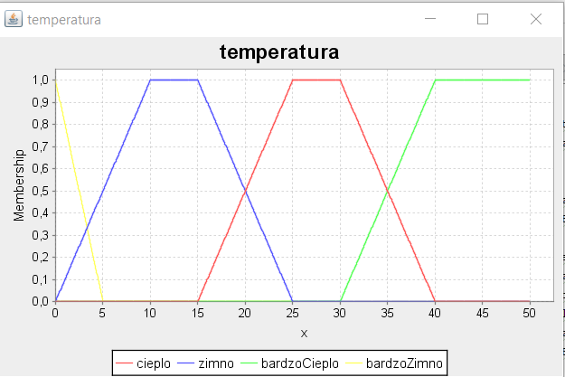
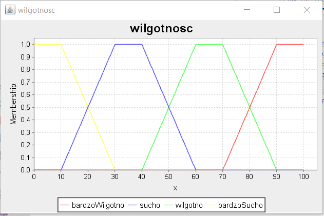

# Watering controller
Kontroler obsługujący system nawadniania roślin napisany w oparciu o zbiory rozmyte w bilbiotece Fuzzy.
W zależności od danych wejściowych jakimi są stopień nawadniania, temperatura i wilgotność rozstrzyga o ile powinien 
zostać zmieniony stopień nawadniania w danych warunkach.

## Uruchomienie:
`java WateringFuzzy <plik_fcl> <stopien nawadniania> <temperatura> <wilgotnosc>`

## Wejście
Stopień nawadniania: (0 .. 10)

Temperatura: (0 .. 50)

Wilgotność: (0 .. 100)

## Wyjście
Zmiana stopnia nawadniania: (0 .. 10)

## Przykład
`java WateringFuzzy watering_controller.fcl 3 25 50`
